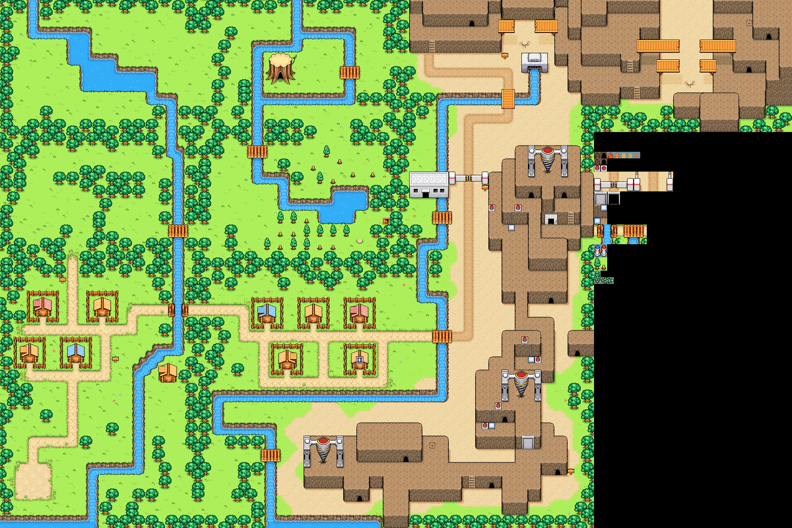

# bomberman-map
Extract maps from Bomberman Tournament or Jetters as images.



# Usage
Copy jetters.gba into the main directory and install Rust.

For Windows you can install Rust using the official installer: https://static.rust-lang.org/rustup/dist/x86_64-pc-windows-msvc/rustup-init.exe

In the same directory just run this command and BMPs will be generated.
```
cargo run -- jetters.gba
```

# Introduction
Just a fun project to extract the backgrounds from Bomberman Jetters. The format of the backgrounds should be similar (or same) for Bomberman Tournament.

For now, this project can extract the main backgrounds from Jetters. An example of the background is shown above.
(It's PNG for the sake of uploading to GitHub, but the program will produce BMPs... For now.)

Currently this project is a work-in-progress... Just a collection of code snippets but most of the basic work is done.

The main purpose is just to extract backgrounds... But more can always be done. Most importantly, this project is meant to document some of the technical details required to extract these backgrounds.

# Technical Decisions

## Using Rust (and thoughts)
In comparison to using C, a lot of "basic" features are simply included within the Rust core library. I didn't want to build everything up from the ground, like a vector (dynamic array), within C that may or may not break later on...

In theory C could have all of these features within the standard library... Though seemingly Rust is what C++ should have been. (Rust makes it easy to allocate and free memory since it's done automatically with a borrow checker...)

Fighting with the Rust compiler can be annoying at times... However, things don't break and time isn't wasted on memory bugs... Overall a nice experience with certain bells and whistles included.

Rust does have a functional style. You could do a lot of the "basic" things sorting, deduplicating, or filtering things... Operations like these can be non-trivially long to write within C. This of course can make Rust code very dense and perhaps intimidating to read. In some sense though Rust is a higher-level language and you don't have to spend a lot of time trying to parse for loops within C...

In a lot of ways, Rust crystalizes a lot of patterns into specific functions... A major example would be Rust's Iterator. In C it's a pointer to an array of a certain type... Going to the next element means adding by that type's size. Rust would abstract away the need to add by that specific size to iterate to the next element... For another example, the deduplicating in Rust requires sorting first. This makes sense and makes Rust code transparent. (While a lot of scripting languages are not very transparent and certain libraries have its own conventions...)

## Image Format
Currently images are output as BMP files. BMP is chosen for its simplicity and for the ability to use a palette.

Here are resources describing the BMP format:
- http://www.dragonwins.com/domains/getteched/bmp/bmpfileformat.htm
- https://gibberlings3.github.io/iesdp/file_formats/ie_formats/bmp.htm
- https://www.martinreddy.net/gfx/2d/BMP.txt

An interesting thing to note about BMP is that a negative height flips the image vertically. We want a negative height so that our first pixel is at the top-left corner.

# Technical Details

## Storage of Background Entries

For Jetters, an array of pointers to five sets of entries is located at 0x819D420.

Each set is an array of entries of 68 bytes.

## Background Entries

| Offset | Size | Description |
| ------ | ---- | ----------- |
| 0 | u32 | Pointer to palette data. These palettes have 192 colors / 0x180 bytes. |
| 4 | u32 | ??? ROM Location. A null value would give a default of: 0x202_5810. |
| 8 | u32 | ??? ROM Location. A null value would give a default of: 0x200_0010. |
| 0xC | u32 | Pointer to tile data. Can be LZ77 compressed or uncompressed. |
| 0x10 | u32 | Pointer to supertile data. LZ77 compressed. |
| 0x14 | u32 | Pointer to supermap data. LZ77 compressed. |
| 0x18 | u32 | Pointer to supermap width and height. {u16, u16} |
| 0x1C | u32 | ??? ROM Location. |
| 0x20 | u32 | ??? ROM Location. |
| 0x24 | u32 | ??? ROM Location. |
| 0x28 | u32 | ??? ROM Location. |
| 0x2C | u32 | ??? ROM Location. |
| 0x30 | u32 | ??? ROM Location. |
| 0x34 | u32 | ??? ROM Location. |
| 0x38 | u32 | ??? ROM Location. |
| 0x3C | u32 | ??? ROM Location. |
| 0x40 | u16 | ??? Integer |
| 0x42 | u16 | ??? Integer |

### Palette Data

The first 64 colors are used by OBJs while the rest 192 colors are used for the BGs.

### Tile Data

The code checks whether the data is compressed or not by checking if it's an LZ77 header. Needs more research...

For the entries that have palette data, tile data, supertile data, and supermap data; Those entries only contain compressed tile data.

### Supermap width and height

The width and height refer to the amount of supertiles the supermap stores.

A supertile = 2x2 tiles = 16x16 pixels.

## Supertile Entries

Each supertile is 10 bytes.

| Offset | Size | Description |
| ------ | ---- | ----------- |
| 0 | u16 | ??? Tile type/flags. |
| 4 | u16 x 4 | BG Map data. |

The map data is what you typically expect for "normal" maps... It starts at the top-left and ends in the bottom-right. Thus each supertile consists of 2x2 tiles.

In this pattern:
```
0 1
2 3
```

Refer to for details on the character data: https://problemkaputt.de/gbatek.htm#lcdvrambgscreendataformatbgmap

The first u16 likely stores flags to indicate whether it's a wall or information not related to rendering... To be researched.

## Supermap Entries

Each supermap entry is simply a u16 storing an offset to a supertile. Not verified if there's any special codes.
